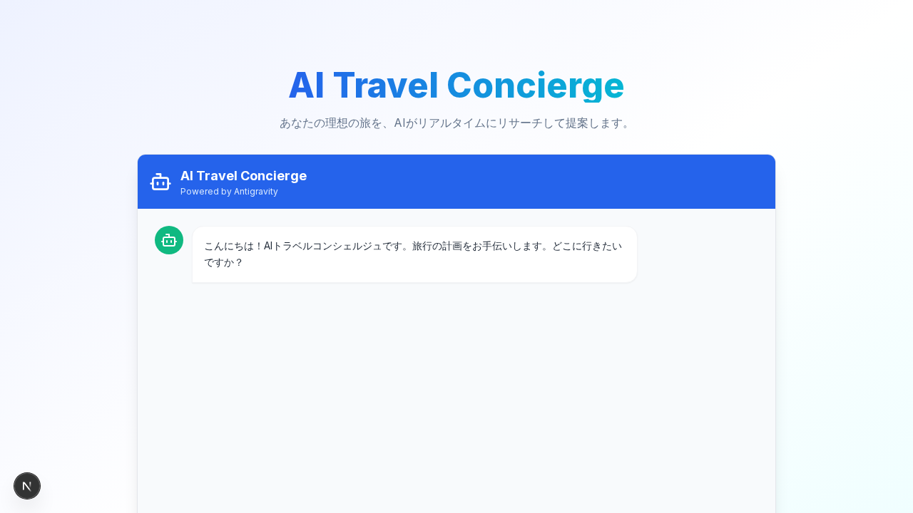

# AI Travel Concierge (Antigravity Voyager)

AI Travel Conciergeは、曖昧なユーザーの要望（例：「京都のホテルを探して」）を理解し、自律的にWeb上の旅行情報をリサーチして最適なプランを提案する、インテリジェントな旅行計画アシスタントです。



## 主な機能

- **自律リサーチ機能**:  
  ユーザーの意図を理解し、ヘッドレスブラウザ (Playwright) を使用して自律的にWebサイトから情報を収集します。
- **インタラクティブなチャットUI**:  
  Next.jsとTailwind CSSで構築された、モダンでレスポンシブなチャットインターフェースです。
- **リッチなユーザー体験**:
  - **天気情報の統合**: OpenMeteo APIを使用し、現地のリアルタイムな天気を表示します。
  - **地図の視覚化**: 抽出された場所に基づいてGoogle Mapsを埋め込み表示します。
  - **カレンダー連携**: 旅行の予定を`.ics`ファイルとして生成し、カレンダーアプリに簡単に追加できます。
- **コンテナ化されたアーキテクチャ**:  
  DockerおよびDocker Composeによる完全なコンテナ環境で、セットアップとデプロイが容易です。

## 技術スタック

- **Frontend**: Next.js 14, TypeScript, Tailwind CSS
- **Backend**: FastAPI (Python 3.9), Playwright (Webスクレイピング)
- **Database**: PostgreSQL (履歴保存用・予定)
- **Infrastructure**: Docker, Docker Compose

## 始め方 (Getting Started)

### 前提条件

- Docker
- Docker Compose

### インストール手順

1. リポジトリをクローンします:
   ```bash
   git clone https://github.com/Na7ti/antigravity-voyager.git
   cd antigravity-voyager
   ```

2. アプリケーションを起動します:
   ```bash
   docker-compose up --build
   ```

3. ブラウザでアクセスします:
   - フロントエンド: [http://localhost:3000](http://localhost:3000)
   - バックエンドAPIドキュメント: [http://localhost:8000/docs](http://localhost:8000/docs)

## 使い方

1. チャット画面を開きます。
2. 「京都のホテルを探して」や「沖縄に行きたい」のように入力します。
3. AIエージェントがリサーチを行い、ホテルの候補、現地の天気、地図、カレンダー追加用のリンクを含むサマリーを返信します。

## プロジェクト構成

```
├── backend/            # FastAPIアプリケーション & リサーチエージェント
│   ├── agent.py        # Playwrightによるブラウザ操作実装
│   ├── main.py         # APIエンドポイント
│   └── Dockerfile
├── frontend/           # Next.jsアプリケーション
│   ├── app/            # App router & コンポーネント
│   └── Dockerfile
└── docker-compose.yml  # コンテナオーケストレーション設定
```

## ライセンス

MIT
